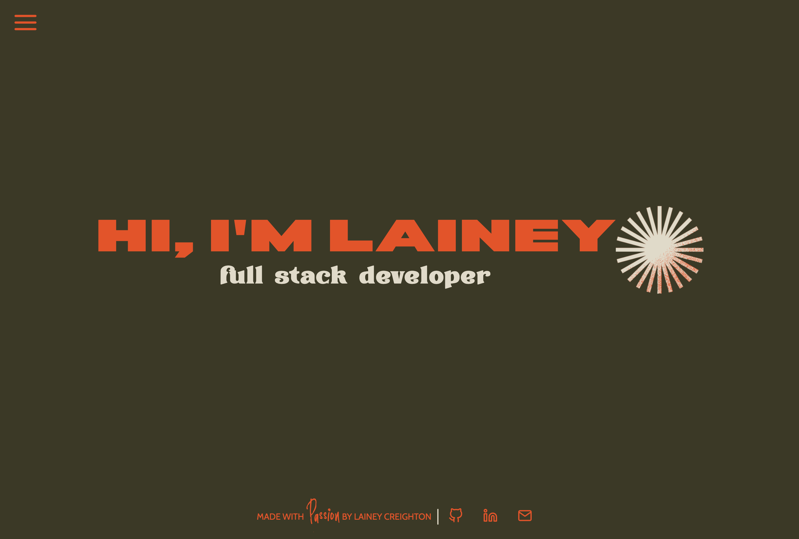
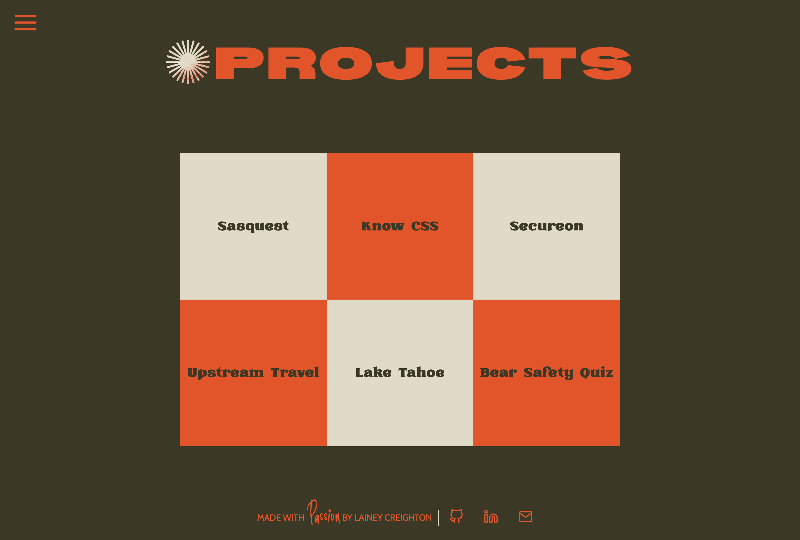
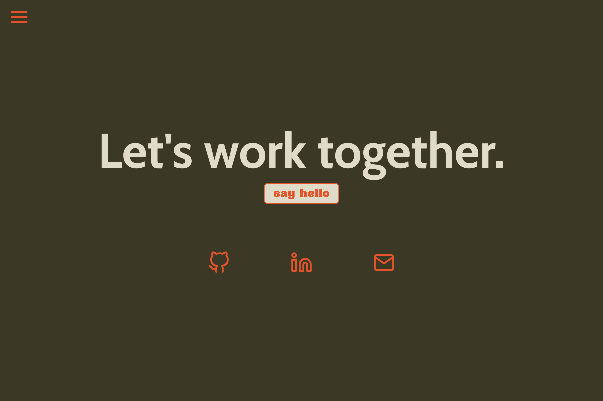

# Lainey Creighton | Portfolio

## Table of Contents
- [Description](#description)
- [Learning Points](#learning-points)
- [Technology Used](#technology-used)
- [Deployment](#deployment)
- [Authors](#authors)
- [Contributing](#contributing)
- [License](#license)

## Description

Welcome to my portfolio! I'm passionate about problem-solving and creativity, which led me to pursue a career in full stack web development. My primary focus is on JavaScript and React for front-end development, and I'm well-versed in backend technologies, including SQL, MongoDB, and GraphQL.

One of my proudest achievements is earning my Full Stack Web Development Certificate from UC Berkeley, showcasing my dedication to continuous learning and skill development.

With a background in events and hospitality management, I've honed leadership skills over eight years. As I transition into software development, my aspiration is to leverage this experience to lead and nurture strong, cohesive development teams while climbing the ladder in the tech industry.

Thank you for visiting my portfolio, and I'm excited to share my projects and contributions with you.

 

## Learning Points

- How to use Create Vite.
- How to use React Components.
- How to style a React application.
- How to use configure React paths.

 

## Technology Used

**Front End**
 

 &nbsp;&nbsp;&nbsp;&nbsp; 
 &nbsp;&nbsp;&nbsp;&nbsp; 
 &nbsp;&nbsp;&nbsp;&nbsp; 
 &nbsp;&nbsp;&nbsp;&nbsp; 
 &nbsp;&nbsp;&nbsp;&nbsp; 

 

**Deployment**
 

 

## Deployment

Website URL: [Lainey Creighton](https://laineycreighton.com/)

 

## Author

### Lainey Creighton

**Contact me using the information below:**

 &nbsp;&nbsp;&nbsp;&nbsp; 
 &nbsp;&nbsp;&nbsp;&nbsp; 
 &nbsp;&nbsp;&nbsp;&nbsp; 

 

## Contributing

Contributions are welcome! If you encounter any issues or have suggestions for improvements, please feel free to submit a pull request.
 

## License

N/A